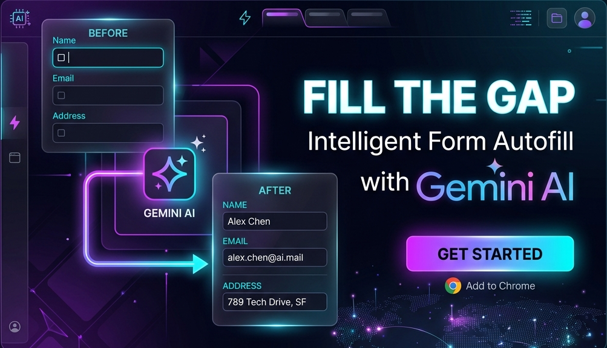
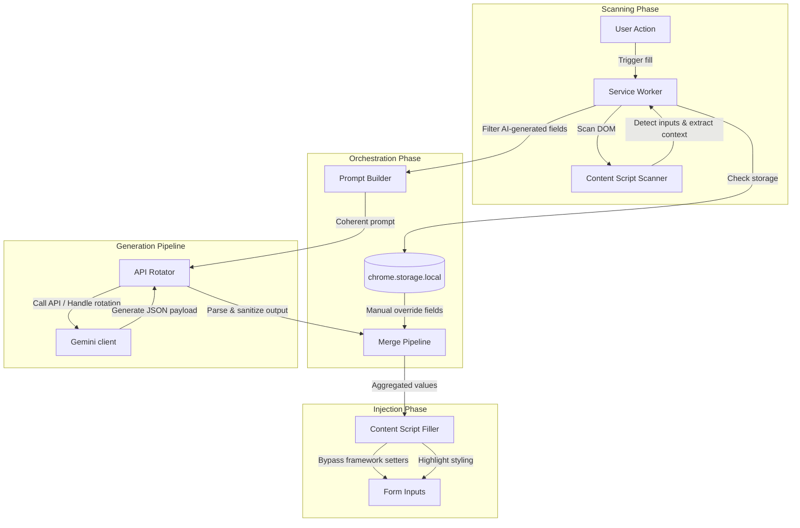

# Fill The Gap — Chrome Extension

Intelligent Form Autofill Powered by **Gemini AI** with **Seamless API Key Rotation**.



---

## Overview

**Fill The Gap** is a high-performance developer tool and utility extension that scans complex form layouts (standard DOM, Shadow DOM, and same-origin frames) and fills them with coherent, context-aware mock data. Leveraging the Gemini API, it dynamically recognizes page context and generates fields that align perfectly with the target page. 

It contains an enterprise-grade **multi-key rotation layer** that recovers from rate limits, client errors, or quota exhaustion seamlessly by cycling through a pool of configured keys.

---

## System Architecture



---

## Key Features

| Feature | Description |
| :--- | :--- |
| **Universal DOM Scanner** | Evaluates explicit labels, placeholders, aria attributes, name, id, and nearby context tags recursively. |
| **13-Key API Rotator** | Automatic load balancing and error recovery. Rotates keys on HTTP `429` / `RESOURCE_EXHAUSTED` with circuit breakers. |
| **Manual Field Bypass** | Local storage cache for sensitive data (passwords, emails). These bypass Gemini entirely and are filled instantly. |
| **Context Coherence** | Evaluates the entire page context in a single request, ensuring SKUs, descriptions, prices, and names belong to the same product category. |
| **Virtual DOM Compatibility** | Directly manipulates native property descriptors to bypass React, Vue, Svelte, and Angular event tracking. |

---

## Installation and Setup

### For General Users (Pre-built Release - Easiest)
You do not need to compile any code. Simply download the pre-packaged files from the **Releases** section on the right side of this repository.

#### Option A: Install via CRX File (Recommended)
1. Download `fill-the-gap.crx` from the latest release.
2. In Google Chrome, navigate to `chrome://extensions/`.
3. Enable **Developer mode** via the toggle switch in the top-right corner.
4. Drag and drop the downloaded `fill-the-gap.crx` file anywhere onto the Extensions page. Chrome will ask you to add the extension.

#### Option B: Install via ZIP Folder
1. Download `fill-the-gap.zip` from the latest release and extract (unzip) it.
2. In Google Chrome, navigate to `chrome://extensions/`.
3. Enable **Developer mode** via the toggle switch in the top-right corner.
4. Click **Load unpacked** in the top-left and select the extracted folder.

---

### For Developers (Build from Source)
If you want to modify the code or compile the extension manually:

1. **Install Dependencies**
   ```bash
   npm install
   ```

2. **Generate Extension Icons**
   ```bash
   npm run generate-icons
   ```

3. **Build the Extension**
   ```bash
   # Production Bundle
   npm run build

   # Development Mode (watch files)
   npm run dev
   ```

4. **Load in Chrome**
   - Go to `chrome://extensions/` and enable **Developer mode**.
   - Click **Load unpacked** and select the compiled `dist/` folder in your workspace root.

---

## Configuration & Key Rotation

Access the extension **Settings** to set up:

* **API Keys:** Paste your raw Gemini API keys (comma-separated or `GEMINI_KEYS=` export format). The engine handles round-robin key switching. If a key generates 3 consecutive errors, it is placed on a **15-minute cooldown** before re-entering rotation.
* **Manual Fields:** Define templates (like `email`, `first_name`, `password`) that represent personal or static mock data. Any field matching these keys will bypass AI generation and inject your stored string natively.

---

## Security & Privacy

* **Zero-Knowledge Architecture:** Manual fields (passwords, usernames, phone numbers) are processed directly inside your browser container using `chrome.storage.local`. They are **never** bundled in payload context sent to Google Gemini endpoints.
* **Strict Local Scope:** Your API keys are stored entirely in local browser sandboxes and are only transmitted directly to Google's official Gemini API REST endpoints.
